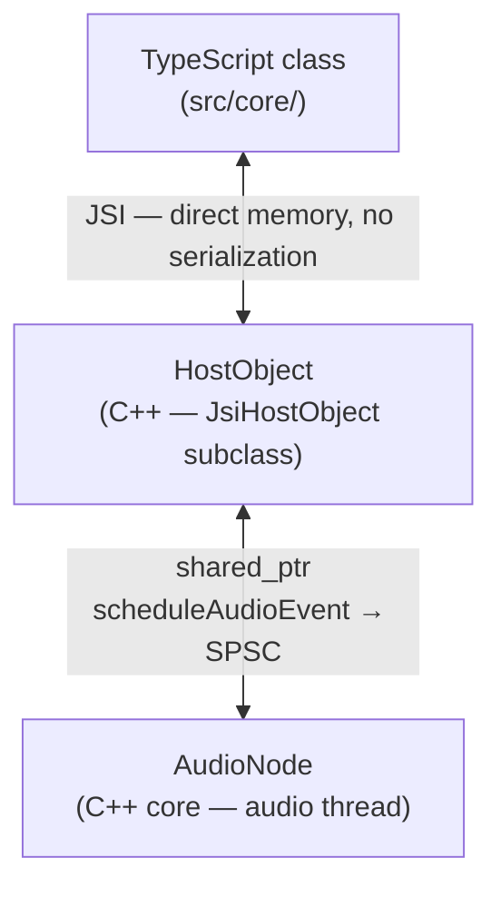

# Skill: HostObjects

Scope: C++ JSI HostObject layer — `packages/react-native-audio-api/common/cpp/audioapi/HostObjects/`

HostObjects are the middle layer between the TypeScript API and the C++ audio engine. They expose C++ audio node state and methods to JavaScript via JSI (no bridge serialization), and route state changes to the audio thread via a lock-free SPSC event queue.

Golden references: `GainNodeHostObject.h/.cpp` (effect node), `OscillatorNodeHostObject.h/.cpp` (source node). Mirror their structure for any new HostObject. See [full examples](examples.md) for annotated implementations.

---

## Critical Pitfalls — Read Before Writing Any Code

- **NEVER read from `node_` in a getter** if the property can be written by the audio thread. Use shadow state or atomics instead.
- **NEVER call `node_->someMethod()` directly from a setter** — always schedule via `scheduleAudioEvent`. The audio thread may be mid-render.
- **ALWAYS register getters/setters/functions in the constructor.** Anything not added to `addGetters`/`addSetters`/`addFunctions` is silently missing from JS.
- **Match property names exactly.** The string in `JSI_EXPORT_PROPERTY_GETTER` becomes the JS property name. A typo means the property doesn't exist in JS.
- **Clear callback IDs in the destructor** for any HO that registers audio events. Otherwise the audio thread fires into a destroyed JS function.
- **Call `setExternalMemoryPressure`** when returning HOs or typed arrays backed by large native buffers.
- **Shadow state must be initialized** from `options` in the constructor — JS may read a property before ever setting it.

---

## Three-Layer Architecture

Every audio node has three layers. HostObject is the middle one:



There is **no strong typing** between the C++ HostObject and the TypeScript interface. Alignment is by convention — property names and function signatures must match manually.

---

## Directory Structure

```
HostObjects/
├── AudioNodeHostObject.h/.cpp            # Base for all audio node HOs
├── AudioParamHostObject.h/.cpp           # AudioParam wrapper
├── BaseAudioContextHostObject.h/.cpp     # Factory — all createXxx() methods live here
├── AudioContextHostObject.h/.cpp         # Realtime context (adds close/resume/suspend)
├── OfflineAudioContextHostObject.h/.cpp
├── analysis/
│   └── AnalyserNodeHostObject.h/.cpp
├── destinations/
│   └── AudioDestinationNodeHostObject.h
├── effects/
│   ├── GainNodeHostObject.h/.cpp
│   ├── BiquadFilterNodeHostObject.h/.cpp
│   ├── DelayNodeHostObject.h/.cpp
│   ├── IIRFilterNodeHostObject.h/.cpp
│   ├── StereoPannerNodeHostObject.h/.cpp
│   ├── WaveShaperNodeHostObject.h/.cpp
│   ├── ConvolverNodeHostObject.h/.cpp
│   ├── WorkletNodeHostObject.h/.cpp
│   └── WorkletProcessingNodeHostObject.h/.cpp
├── sources/
│   ├── AudioScheduledSourceNodeHostObject.h/.cpp  # Base for timed sources
│   ├── AudioBufferBaseSourceNodeHostObject.h/.cpp # Base for buffer sources
│   ├── OscillatorNodeHostObject.h/.cpp
│   ├── AudioBufferSourceNodeHostObject.h/.cpp
│   ├── AudioBufferQueueSourceNodeHostObject.h/.cpp
│   ├── ConstantSourceNodeHostObject.h/.cpp
│   ├── StreamerNodeHostObject.h/.cpp
│   ├── AudioBufferHostObject.h/.cpp               # Data container, not a node
│   └── RecorderAdapterNodeHostObject.h/.cpp
├── inputs/
│   └── AudioRecorderHostObject.h/.cpp
├── events/
│   └── AudioEventHandlerRegistryHostObject.h/.cpp
└── utils/
    ├── JsEnumParser.h/.cpp      # Enum ↔ string conversions
    ├── NodeOptionsParser.h      # Parses JS option objects into C++ structs
    ├── AudioDecoderHostObject.h/.cpp
    └── AudioFileUtilsHostObject.h/.cpp
```

---

## Macro System

All HostObjects use macros defined in `jsi/JsiHostObject.h`. Always use these — never write raw JSI dispatch code.

### Declaration macros (in .h)

```cpp
JSI_PROPERTY_GETTER_DECL(gain)         // jsi::Value gain(jsi::Runtime &runtime)
JSI_PROPERTY_SETTER_DECL(gain)         // void gain(jsi::Runtime &runtime, const jsi::Value &value)
JSI_HOST_FUNCTION_DECL(setValueAtTime) // jsi::Value setValueAtTime(jsi::Runtime &, const jsi::Value &, const jsi::Value *, size_t)
```

### Implementation macros (in .cpp)

```cpp
JSI_PROPERTY_GETTER_IMPL(GainNodeHostObject, gain) { ... }
JSI_PROPERTY_SETTER_IMPL(GainNodeHostObject, gain) { ... }
JSI_HOST_FUNCTION_IMPL(GainNodeHostObject, setValueAtTime) { ... }
```

### Registration macros (in constructor)

```cpp
addGetters(
    JSI_EXPORT_PROPERTY_GETTER(GainNodeHostObject, gain));
addSetters(
    JSI_EXPORT_PROPERTY_SETTER(GainNodeHostObject, fftSize));
addFunctions(
    JSI_EXPORT_FUNCTION(GainNodeHostObject, connect),
    JSI_EXPORT_FUNCTION(GainNodeHostObject, disconnect));
```

**All getters, setters, and functions must be registered in the constructor.** Anything not registered is invisible to JS.

---

## Shadow State

Shadow state is the core pattern for JS↔audio-thread communication (introduced in PR #942).

### The Problem

The audio node's C++ state is read and written on the **audio thread**. JS runs on a different thread. Without shadow state, reading a property from JS would require either a lock (forbidden on the audio thread) or an atomic (only works for primitives).

### The Solution

The HostObject maintains its own **copy** of the node's properties — the shadow state. This copy:
- Is read/written **only by the JS thread**
- Is always in sync with what JS last set
- Is the source of truth for JS reads

When JS sets a property:
1. Update the shadow copy immediately (JS thread)
2. Schedule an event on `CrossThreadEventScheduler` that will apply the change on the audio thread

When JS reads a property:
1. Return the shadow copy — **do not touch the C++ node**

```cpp
// Header — shadow state declared as private member
class OscillatorNodeHostObject : public AudioScheduledSourceNodeHostObject {
 public:
  JSI_PROPERTY_GETTER_DECL(type);
  JSI_PROPERTY_SETTER_DECL(type);
 private:
  OscillatorType type_;  // shadow copy of node_->type_
};

// Getter — returns shadow, never touches audio thread
JSI_PROPERTY_GETTER_IMPL(OscillatorNodeHostObject, type) {
  return jsi::String::createFromUtf8(
      runtime, js_enum_parser::oscillatorTypeToString(type_));
}

// Setter — updates shadow + schedules audio thread update
JSI_PROPERTY_SETTER_IMPL(OscillatorNodeHostObject, type) {
  auto oscillatorNode = std::static_pointer_cast<OscillatorNode>(node_);
  auto type = js_enum_parser::oscillatorTypeFromString(
      value.asString(runtime).utf8(runtime));

  // 1. Update shadow state (JS thread, immediate)
  type_ = type;

  // 2. Schedule audio thread update (lock-free SPSC)
  auto event = [oscillatorNode, type](BaseAudioContext &) {
    oscillatorNode->setType(type);
  };
  oscillatorNode->scheduleAudioEvent(std::move(event));
}
```

### When NOT to use shadow state

| Scenario | Pattern |
|---|---|
| Primitive, only written by JS | Shadow state (standard) |
| Non-primitive, only written by JS | Store in TS layer, pass to AudioNode when needed |
| Primitive, can be written by audio thread | `std::atomic<T>` on the C++ node; read directly via getter |
| Non-primitive, can be written by audio thread | Triple buffer pattern (see `AnalyserNode` for reference) |

### AudioParam is a special case

`AudioParam::value_` is `std::atomic<float>` because it can be updated by the audio thread during automation. The HO reads it directly:

```cpp
JSI_PROPERTY_GETTER_IMPL(AudioParamHostObject, value) {
  return {param_->getValue()};  // atomic read, no shadow needed
}

JSI_PROPERTY_SETTER_IMPL(AudioParamHostObject, value) {
  auto event = [param = param_, v = static_cast<float>(value.getNumber())](BaseAudioContext &) {
    param->setValue(v);
  };
  param_->scheduleAudioEvent(std::move(event));
}
```

### Shadow state must be initialized in the constructor

Initialize shadow members from `options` in the constructor — JS may read a property before ever setting it:

```cpp
OscillatorNodeHostObject::OscillatorNodeHostObject(...) {
  type_ = options.type;  // Initialize shadow from options
}
```

---

## Argument Parsing

### Primitives

```cpp
float v       = static_cast<float>(args[0].getNumber());
double d      = args[0].getNumber();
int i         = static_cast<int>(args[0].getNumber());
bool b        = args[0].getBool();
std::string s = args[0].getString(runtime).utf8(runtime);
```

### Optional arguments — check count first

```cpp
// args[2] is optional, default -1
double duration = (count > 2 && !args[2].isUndefined()) ? args[2].getNumber() : -1.0;
```

Use `jsiutils::argToString(runtime, args, count, index, defaultValue)` for optional string args.

### TypedArrays (Float32Array, Uint8Array, etc.)

JS typed arrays are passed as objects with a `.buffer` property:

```cpp
JSI_HOST_FUNCTION_IMPL(AnalyserNodeHostObject, getByteFrequencyData) {
  auto arrayBuffer = args[0]
      .getObject(runtime)
      .getPropertyAsObject(runtime, "buffer")
      .getArrayBuffer(runtime);
  auto data   = arrayBuffer.data(runtime);
  auto length = static_cast<int>(arrayBuffer.size(runtime));

  auto analyserNode = std::static_pointer_cast<AnalyserNode>(node_);
  analyserNode->getByteFrequencyData(data, length);
  return jsi::Value::undefined();
}
```

For Float32Arrays (reinterpret the bytes):

```cpp
auto rawValues = reinterpret_cast<float *>(arrayBuffer.data(runtime));
auto length    = static_cast<int>(arrayBuffer.size(runtime) / sizeof(float));
```

### HostObject arguments (node-to-node)

```cpp
JSI_HOST_FUNCTION_IMPL(AudioNodeHostObject, connect) {
  auto obj = args[0].getObject(runtime);
  if (obj.isHostObject<AudioNodeHostObject>(runtime)) {
    auto other = obj.getHostObject<AudioNodeHostObject>(runtime);
    node_->connect(other->node_);
  } else if (obj.isHostObject<AudioParamHostObject>(runtime)) {
    auto param = obj.getHostObject<AudioParamHostObject>(runtime);
    node_->connect(param->param_);
  }
  return jsi::Value::undefined();
}
```

### Extracting a HostObject's inner C++ object

```cpp
auto periodicWave = args[0]
    .getObject(runtime)
    .getHostObject<PeriodicWaveHostObject>(runtime);
oscillatorNode->setPeriodicWave(periodicWave->periodicWave_);
```

---

## Return Value Patterns

### Primitives

```cpp
return {fftSize_};                                          // int/float/double
return {true};                                              // bool
return jsi::String::createFromUtf8(runtime, "suspended");  // string
return jsi::Value::undefined();                             // void
return jsi::Value::null();                                  // null
```

### A HostObject

```cpp
JSI_PROPERTY_GETTER_IMPL(GainNodeHostObject, gain) {
  auto gainNode  = std::static_pointer_cast<GainNode>(node_);
  auto gainParam = std::make_shared<AudioParamHostObject>(gainNode->getGainParam());
  return jsi::Object::createFromHostObject(runtime, gainParam);
}
```

### A plain JS object

```cpp
auto result = jsi::Object(runtime);
result.setProperty(runtime, "status", jsi::String::createFromUtf8(runtime, "success"));
result.setProperty(runtime, "path",   jsi::String::createFromUtf8(runtime, path));
return result;
```

### A Float32Array wrapping native memory

```cpp
JSI_HOST_FUNCTION_IMPL(AudioBufferHostObject, getChannelData) {
  auto channel          = static_cast<int>(args[0].getNumber());
  auto audioArrayBuffer = audioBuffer_->getSharedChannel(channel);
  auto arrayBuffer      = jsi::ArrayBuffer(runtime, audioArrayBuffer);

  auto float32ArrayCtor = runtime.global()
      .getPropertyAsFunction(runtime, "Float32Array");
  auto float32Array = float32ArrayCtor
      .callAsConstructor(runtime, arrayBuffer)
      .getObject(runtime);

  float32Array.setExternalMemoryPressure(runtime, audioArrayBuffer->size());
  return float32Array;
}
```

### External memory pressure

Call `setExternalMemoryPressure` whenever returning a HostObject or typed array that wraps a large native buffer. This lets the JS GC schedule collection correctly:

```cpp
jsiObject.setExternalMemoryPressure(runtime, bufferHostObject->getSizeInBytes());
```

---

## Enum Parsing

Use `JsEnumParser` (`utils/JsEnumParser.h`) for all enum ↔ string conversions. Never hardcode strings.

```cpp
// String → enum
auto type = js_enum_parser::oscillatorTypeFromString(
    value.asString(runtime).utf8(runtime));

// Enum → string
return jsi::String::createFromUtf8(
    runtime, js_enum_parser::oscillatorTypeToString(type_));
```

When adding a new enum, add both directions to `JsEnumParser`.

---

## Destructor: Clearing Callbacks

When a HostObject is garbage collected, registered audio callbacks must be cleared. Otherwise the audio thread fires into a destroyed JS function.

```cpp
AudioScheduledSourceNodeHostObject::~AudioScheduledSourceNodeHostObject() {
  auto node = std::static_pointer_cast<AudioScheduledSourceNode>(node_);
  node->setOnEndedCallbackId(0);  // 0 = no listener
}
```

Apply this for every `std::atomic<uint64_t>` callback ID on the node.

---

## TypeScript Counterpart

Each HO must have a matching TS interface and class in `packages/react-native-audio-api/src/core/`.

```ts
// Interface — mirrors C++ HO properties exactly (src/core/interfaces/)
export interface IGainNode extends IAudioNode {
  readonly gain: IAudioParam;
}

// TS class — wraps the C++ HO (src/core/)
class GainNode extends AudioNode {
  readonly gain: AudioParam;

  constructor(context: BaseAudioContext, options?: TGainOptions) {
    // context.context is the C++ BaseAudioContextHostObject
    const gainNode: IGainNode = context.context.createGain(options ?? {});
    super(context, gainNode);
    this.gain = new AudioParam(gainNode.gain, context);
  }
}
```

See the `turbo-modules` skill for full TS wiring details.

---

## Adding to BaseAudioContextHostObject

Every new node needs a factory method. Three steps:

### 1. Declare in `BaseAudioContextHostObject.h`

```cpp
JSI_HOST_FUNCTION_DECL(createMyNode);
```

### 2. Register in `BaseAudioContextHostObject` constructor

```cpp
addFunctions(
    // ... existing entries
    JSI_EXPORT_FUNCTION(BaseAudioContextHostObject, createMyNode));
```

### 3. Implement in `BaseAudioContextHostObject.cpp`

```cpp
JSI_HOST_FUNCTION_IMPL(BaseAudioContextHostObject, createMyNode) {
  MyNodeOptions options = NodeOptionsParser::parseMyNodeOptions(runtime, args, count);
  auto myNode = std::make_shared<MyNodeHostObject>(context_, options);
  return jsi::Object::createFromHostObject(runtime, myNode);
}
```

Also add `createMyNode()` to the C++ `BaseAudioContext` factory — see the `audio-nodes` skill.

---

---

*Maintenance: see [maintenance.md](maintenance.md).*
