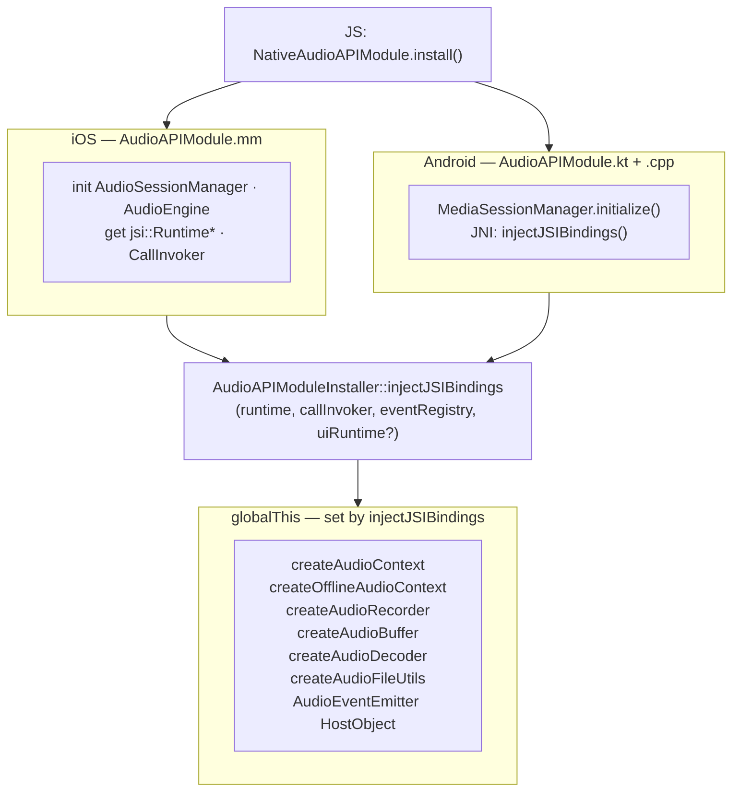

# Skill: TurboModules & JSI Installation

## When to Use TurboModule vs HostObjects

**Rule**: if it needs `AVAudioSession`, `AudioManager`, `MediaSession`, or OS permissions → TurboModule. If it's audio processing → HostObject installed by `AudioAPIModuleInstaller`.

| Use TurboModule method | Use HostObject property/method |
|---|---|
| Platform system APIs (audio session, permissions, notifications, device routing) | All audio graph operations (create/connect/disconnect nodes, AudioParam, scheduling) |
| One-time initialization (`install`) | Real-time playback control |
| Features that need native UI thread or system callbacks | Features that only need the JSI runtime |
| Android-only or iOS-only behavior | Cross-platform C++ engine behavior |

Most audio nodes do **not** need a TurboModule method — they are exposed entirely through JSI HostObjects injected by `injectJSIBindings`.

---

## Reference

- RN TurboModules (new arch): https://reactnative.dev/docs/the-new-architecture/pure-cxx-modules
- RN JSI: https://reactnative.dev/docs/the-new-architecture/architecture-glossary#javascript-interface-jsi
- fbjni (Android JNI bridge): https://github.com/facebookincubator/fbjni

---

## The Big Picture

Most audio functionality is exposed **not** through TurboModule method calls but through **JSI HostObjects** placed directly on the JS global object. The TurboModule's job is narrow:

1. Be available early via the standard RN module system
2. Provide `install()` — one synchronous call that injects HostObject factories onto `globalThis`
3. Expose platform-specific system APIs (audio session, permissions, notifications, devices) that cannot be done through pure JSI



After `install()` returns, TypeScript code can call `globalThis.createAudioContext(sampleRate)` and get back a HostObject — no serialization, no bridge round-trip.

---

## TurboModule Spec (`src/specs/NativeAudioAPIModule.ts`)

Defines the TypeScript interface for the native module. Codegen (React Native's codegen) generates the native binding glue from this file.

```ts
interface Spec extends TurboModule {
  install(): boolean;                           // synchronous — MUST run first
  getDevicePreferredSampleRate(): number;       // synchronous
  setAudioSessionActivity(enabled: boolean): Promise<boolean>;
  setAudioSessionOptions(...): void;
  observeAudioInterruptions(focusType, enabled): void;
  requestRecordingPermissions(): Promise<PermissionStatus>;
  // ... audio devices, notifications ...
}

const NativeAudioAPIModule = TurboModuleRegistry.get<Spec>('AudioAPIModule')!;
```

**`install()` is synchronous** (`RCT_EXPORT_BLOCKING_SYNCHRONOUS_METHOD` on iOS, `override fun install(): Boolean` on Android). It must complete before the app tries to use any audio API. It is called once during module bootstrap in `src/AudioAPIModule/index.ts`.

**Web mock** (`src/specs/NativeAudioAPIModule.web.ts`): on the web platform, the whole spec is mocked with no-ops and resolved promises (e.g. permissions always return `'Granted'`). This file replaces the native spec at bundle time for web builds.

---

## `AudioAPIModuleInstaller` (`common/cpp/audioapi/AudioAPIModuleInstaller.h`)

The single C++ class that owns JSI injection. It is `#include`-d by both iOS (`.mm`) and Android (`.cpp`) native modules, keeping the injection logic platform-agnostic.

```cpp
class AudioAPIModuleInstaller {
 public:
  static void injectJSIBindings(
      jsi::Runtime *jsiRuntime,
      const std::shared_ptr<react::CallInvoker> &jsCallInvoker,
      const std::shared_ptr<AudioEventHandlerRegistry> &audioEventHandlerRegistry,
      std::shared_ptr<worklets::WorkletRuntime> uiRuntime = nullptr);
};
```

Each `get*Function()` private method creates a `jsi::Function` via `jsi::Function::createFromHostFunction()`. The lambda captures the dependencies it needs (`jsCallInvoker`, `audioEventHandlerRegistry`, `uiRuntime`) by value (shared_ptr).

**Worklets guard**: functions that need the worklets runtime (AudioContext, OfflineAudioContext) have an `#if RN_AUDIO_API_ENABLE_WORKLETS` branch:
```cpp
#if RN_AUDIO_API_ENABLE_WORKLETS
  auto runtimeRegistry = RuntimeRegistry{.uiRuntime = uiRuntime};
  if (count > 1 && args[1].isObject()) {
    runtimeRegistry.audioRuntime = worklets::extractWorkletRuntime(runtime, args[1]);
  }
#else
  auto runtimeRegistry = RuntimeRegistry{};
#endif
```

**Adding a new top-level global**: add a `static jsi::Function getCreateXxxFunction(...)` private method and a `setProperty("createXxx", ...)` call in `injectJSIBindings`. This is only needed for objects that JS creates directly (not objects created as properties of another HostObject).

---

## iOS Native Module (`AudioAPIModule.mm`)

Uses ObjC++ with `RCT_EXPORT_MODULE` and `RCT_EXPORT_BLOCKING_SYNCHRONOUS_METHOD`.

**Key steps in `install`**:
1. Allocate platform managers (`AudioSessionManager`, `AudioEngine`, `SystemNotificationManager`, `NotificationRegistry`)
2. Get `jsi::Runtime *` from the bridge: `reinterpret_cast<facebook::jsi::Runtime *>(self.bridge.runtime)`
3. Get `CallInvoker` — different paths for old Bridge vs New Architecture:
   ```objc
   #if defined(RCT_NEW_ARCH_ENABLED)
     auto jsCallInvoker = _callInvoker.callInvoker;
   #else
     auto jsCallInvoker = self.bridge.jsCallInvoker;
   #endif
   ```
4. Create `AudioEventHandlerRegistry` (owns JS callbacks, needs runtime + callInvoker)
5. Call `AudioAPIModuleInstaller::injectJSIBindings(...)`

**New Architecture support** (`getTurboModule`):
```objc
#ifdef RCT_NEW_ARCH_ENABLED
- (std::shared_ptr<facebook::react::TurboModule>)getTurboModule:
    (const facebook::react::ObjCTurboModule::InitParams &)params
{
  return std::make_shared<facebook::react::NativeAudioAPIModuleSpecJSI>(params);
}
#endif
```
This connects the ObjC implementation to the codegen-generated C++ TurboModule spec.

**`methodQueue`**: the module runs on a dedicated serial queue (`com.swmansion.audioapi.MainModuleQueue`), not the main thread.

**`invokeHandlerWithEventName:eventBody:`**: called from Objective-C system callbacks (audio session interruption, volume change, etc.) to fire events back into JS. It converts `NSDictionary` to `std::unordered_map<std::string, EventValue>` and calls `audioEventHandlerRegistry_->invokeHandlerWithEventBody(...)`.

---

## Android Native Module (`AudioAPIModule.kt` + `AudioAPIModule.cpp`)

Android uses **fbjni HybridObject** — a pattern where a Kotlin class holds a C++ peer via `HybridData`. The Kotlin class handles the Java/Kotlin TurboModule protocol; the C++ peer owns the JSI runtime pointer and call invoker.

### Initialization flow

```
AudioAPIModule.kt (init block)
  ├── System.loadLibrary("react-native-audio-api")        // load .so
  ├── get CallInvokerHolderImpl from reactContext
  ├── get WorkletsModule if worklets enabled
  └── mHybridData = initHybrid(workletsModule, jsContext, callInvokerHolder)
            │
            ▼
      AudioAPIModule.cpp::initHybrid (JNI)
        ├── unwrap jsCallInvoker from holder
        ├── reinterpret_cast<jsi::Runtime *>(jsContext)
        ├── [if worklets] get WorkletsModuleProxy
        └── makeCxxInstance(...)   → creates C++ AudioAPIModule peer
                └── stores: jsiRuntime_, jsCallInvoker_, audioEventHandlerRegistry_
```

```
AudioAPIModule.kt::install()
  ├── MediaSessionManager.initialize(...)
  ├── NativeFileInfo.initialize(...)
  └── injectJSIBindings()   // external fun → JNI call
            │
            ▼
      AudioAPIModule.cpp::injectJSIBindings()
        └── AudioAPIModuleInstaller::injectJSIBindings(...)
```

**`external fun`**: Kotlin keyword for JNI-implemented methods. These are registered in `AudioAPIModule.cpp::registerNatives()`:
```cpp
void AudioAPIModule::registerNatives() {
  registerHybrid({
    makeNativeMethod("initHybrid",          AudioAPIModule::initHybrid),
    makeNativeMethod("injectJSIBindings",   AudioAPIModule::injectJSIBindings),
    makeNativeMethod("invokeHandlerWithEventNameAndEventBody", ...),
  });
}
```

`registerNatives()` is called from `android/src/main/cpp/audioapi/android/OnLoad.cpp` at `.so` load time.

**`invokeHandlerWithEventNameAndEventBody`**: called from Kotlin (MediaSessionManager callbacks) to fire events into JS. Takes a Java `Map<String, Object>` and converts to `std::unordered_map<std::string, EventValue>`.

---

## Two-Architecture Paths Summary

| | Old Bridge | New Architecture (TurboModules/Fabric) |
|---|---|---|
| iOS CallInvoker source | `self.bridge.jsCallInvoker` | `_callInvoker.callInvoker` |
| iOS runtime source | `self.bridge.runtime` (cast) | same |
| iOS codegen | `RCT_EXPORT_MODULE` only | `+ getTurboModule:` implemented |
| Android CallInvoker | `reactContext.jsCallInvokerHolder` | same |
| Android codegen | `NativeAudioAPIModuleSpec` base class | same (generated) |

The JSI injection itself (`AudioAPIModuleInstaller`) is identical for both architectures — it only needs the `jsi::Runtime *` and `CallInvoker`, which are obtained differently but behave the same.

---

---

*Maintenance: see [maintenance.md](maintenance.md).*
